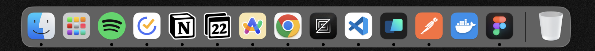

# My Dev Environment Setup (MacOS)

## Dev Tools

- [VS Code](https://code.visualstudio.com/)
- [Warp](https://www.warp.dev/)
- [iTerm2](https://iterm2.com/)
- [Homebrew](https://brew.sh/)
- [Oh My Zsh](https://ohmyz.sh/)
- [Docker](https://www.docker.com/)
- [Postman](https://www.postman.com/)
- [NVM](https://github.com/nvm-sh/nvm)
- [NeoVim](https://neovim.io/)
- [Zed](https://zed.dev/)

## Other Apps

- [ARC](https://arc.net/)
- [Spotify](https://www.spotify.com/)
- [TickTick](https://ticktick.com/)
- [Notion](https://www.notion.so/)
- [Notion Calendar](https://www.notion.so/)
- [Figma](https://www.figma.com/)
- [Raycast](https://raycast.com/)
- [Magnet](https://magnet.crowdcafe.com/)
- [Bartender](https://www.macbartender.com/)
- [CopyClip](https://fiplab.com/apps/copyclip-for-mac/)
- [Mos](https://mos.caldis.me/)
- [IINA](https://iina.io/)
- [KeyEcho](https://github.com/ZacharyL2/KeyEcho)
